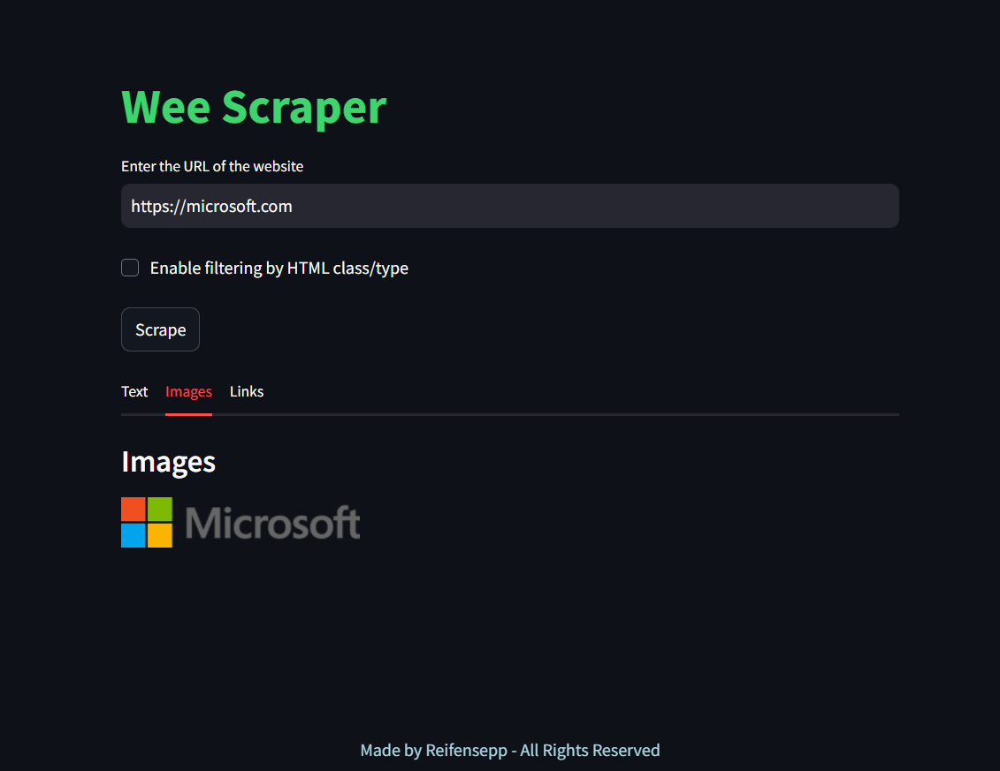
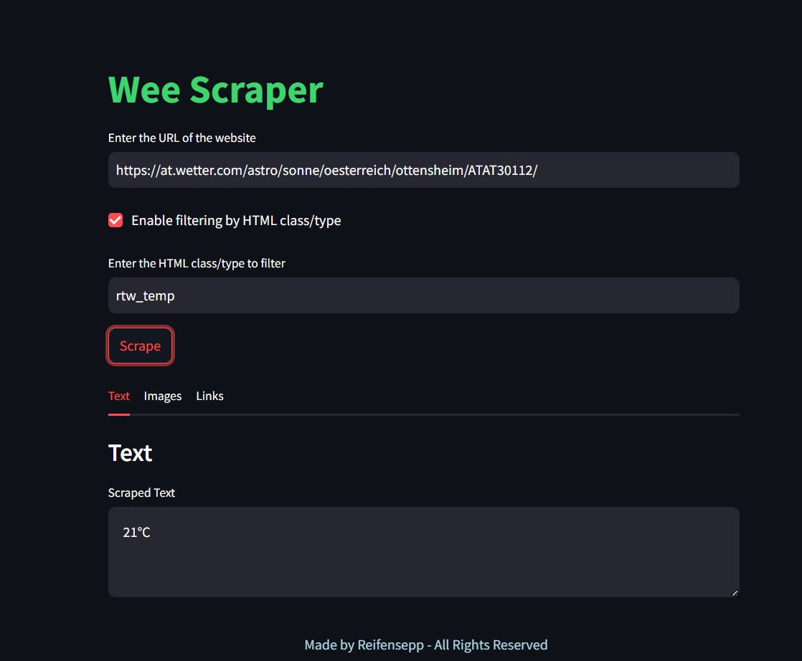

# Wee-Scraper

## Overview

Wee-Scraper is a Python-based web scraper that allows you to extract text, images, and links from any webpage. Built with Streamlit for a user-friendly interface, it also features a filtering system to target specific HTML classes or types.

## Features

- **Text Extraction**: Scrape all visible text from a webpage.
- **Image Extraction**: Download and display all images from the webpage.
- **Hyperlink Extraction**: Retrieve and list all hyperlinks.
- **Filtering System**: Optionally filter elements by HTML class/type.

## Usage

1. **Installation**:
   Ensure you have Python installed. Install the necessary libraries by running:
   ```bash
   pip install requests beautifulsoup4 streamlit
   ```

2. **Running the Scraper**:
   - Save the provided code into a Python file, for example, `wee_scraper.py`.
   - Run the script using Streamlit:
     ```bash
     streamlit run wee_scraper.py
     ```

3. **Interface**:
   - **URL Input**: Enter the URL of the webpage you want to scrape.
   - **Filtering**: Enable or disable filtering by HTML class/type.
   - **Scrape**: Click the "Scrape" button to start extracting data.

4. **Example**:
   - To scrape weather information from a site like `at.wetter.com`, enter the URL and use the class `rtw_temp` to filter.
   - **Output**:
     ```text
     15 C°
     ```

## Screenshots

- **Interface Example**:
  

- **Scraping Example**:
  

## Contributing

Contributions are welcome! If you have suggestions or improvements, please open an issue or submit a pull request.

## License

This project is licensed under the MIT License - see the [LICENSE](LICENSE) file for details.
